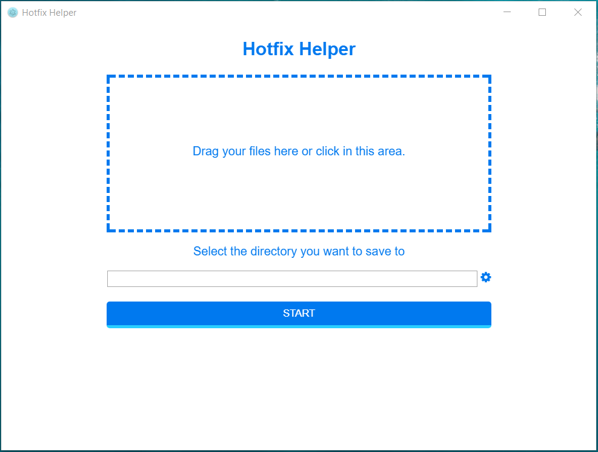

# hotfix maker

This app helps developers to generate hotfix easily. 

## How to use
1. Navigate to the .class files in the File Explorer and Drag the .class files to the box inside the app.
2. Choose where to save your hotfix. The default location is Desktop
3. Click Start button to generate the package of hotfix
4. Copy the generated hotfix package to your remote machine and choose the proper location.

## Node scripts
1. Run it in dev mode
```
npm install
npm start
```
2. Build it (for Windows)
```
npm run package
```
